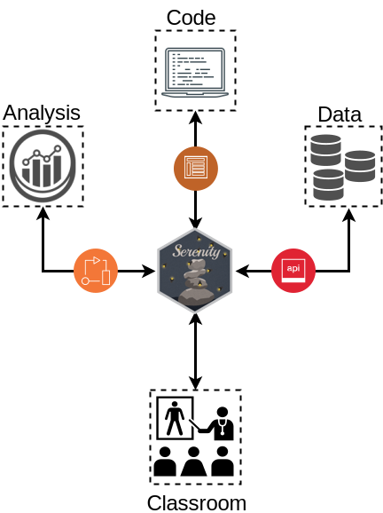

# Building a Gateway Between Classrooms and Data Science Using QUBESHub
### by M. Drew LaMar and Sam Donovan

This respository consists of the presentation slides for a talk given at [The 12th Gateway Computing Environments Conference](https://sciencegateways.org/web/gateways2017), October 23-25, 2017.

* **Conference Proceeding**: LaMar, M. Drew; Donovan, Sam (2017): *Building a Gateway Between Classrooms and Data Science Using QUBESHub*. [doi:10.6084/m9.figshare.5483692.v2](https://doi.org/10.6084/m9.figshare.5483692.v2)
* [Slideshow](https://mdlama.github.io/Prez_17.10.25_Gateways)

Follow Serenity development at <a href="https://github.com/serenity-r">https://github.com/serenity-r</a>

Slides created via the R package <a href="https://github.com/yihui/xaringan">xaringan</a>.
