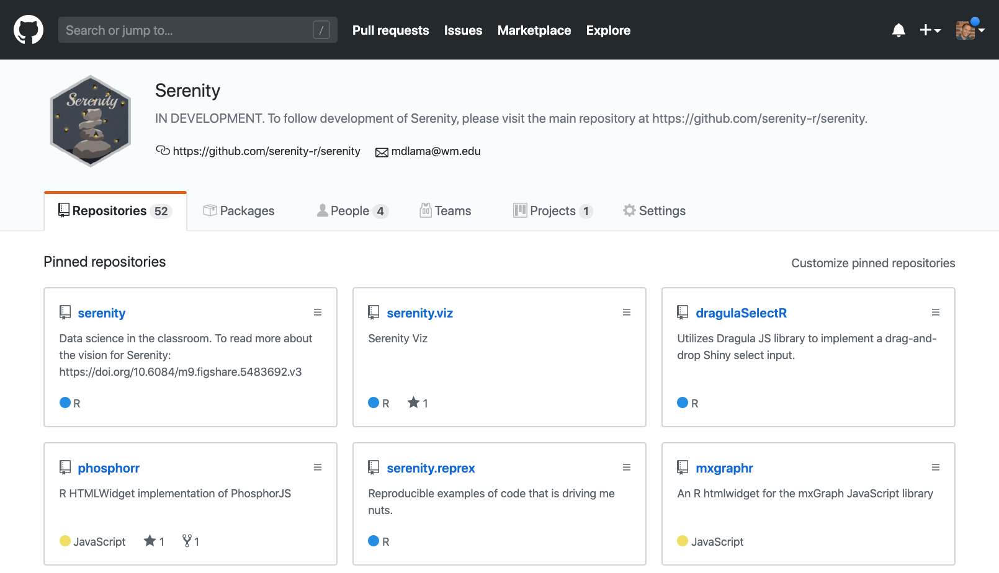

name: qubes
layout: true

.thumbnail-top-right[]

<!--
Used for QUBES logo.  Layout true for this slide then false for the next is necessary to be able to use this as a template in the future, but have it not show.
-->

---

layout: false

# Gateway challenges

### Core challenges
* **Audience (_faculty and students_)**:  Gateway must address two different audiences.
--

* **Context (_research and education_)**:  Faculty themselves have very different needs.
--

* **Content (_faculty training_)**:  Faculty need training not only in computational tools and quantitative/statistical concepts (which are underdeveloped in undergraduate curricula), but also in the pedagogical strategies in bringing these to the classroom.
--


### Cultural challenges
--

* **Isolation**:  Difficult for faculty to share teaching materials and strategies, due to fear of public scrutiny.
--

* **Recognition**:  Recognition of teaching scholarship in hiring, promotion and tenure is underdeveloped and widely variable.
--

* **Adoption**:  Adopting existing teaching materials from repositories is challenging as modifications are almost always necessary.

---

# Educational Gateway
## .subheader[QUBES: Quantitative Undergraduate Biology Education and Synthesis]

<br \>


<blockquote>
QUBES is a community of math and biology educators who share resources and methods for preparing students to use quantitative approaches to tackle real, complex, biological problems.
</blockquote>

---

# QUBES: Quantitative Undergraduate Biology Education and Synthesis

.center[

]

.footnote[
<br \>
]

.right[
https://qubeshub.org
]

???

What is QUBES?

---

# Data Science challenges (in Biology)

 * **Faculty training**: Biology faculty are not domain experts in statistics and data analysis
--

 * **Messy data**: Many opportunities in using real data, but *real data is messy*
--

 * **Complex software**: Many opportunities in using research tools, but *software is complex*
--

 * **Accessibility**:
   * Lack of user-friendly *open-source* software
--

   * Computers in labs might require substantial setup prior to use of software
--

   * Student laptops are highly variable in computational ability, setup and maintenance
--

 * **Cognitive overload**: Biology students need to learn biology, math, physics, chemistry, statistics, experimental design, data skills, etc.
--

   * **Scripting/Programming**: Reproducibility is becoming more important in science.

---

background-image: url(www/img/thecarpentries.jpg)
background-size: contain

# Faculty Training Solutions
## .subheader[
The Carpentries
]

.credit[Image credit: http://cgrb.oregonstate.edu/service-spotlight/software-carpentry]

---

# Faculty Training Solutions
## .subheader[
QUBES Faculty Mentoring Networks
]

.pull-left[
### Faculty Mentoring Networks are:
* Online groups, typically 10-15 faculty members
* Focused on a specific topic or material
* Typically meet every two weeks over a period of several months
* Led by teams of expert content and pedagogy mentors
]

--

.pull-right[

]

---

# Accessibility Solutions
## .subheader[
Software "in the cloud"
]

<br \>
.center[

]

.credit[Image credit: http://insights.speakwithageek.com/post/Top-Benefits-of-Cloud-Computing-in-Education]

---

# Accessibility Solutions

## .subheader[
Jupyter and R Notebooks
]

<br \>
<br \>
.center[


]

.footnote[
[http://jupyter.org/](http://jupyter.org/)<br \>
[Why I love R Notebooks](https://www.r-bloggers.com/why-i-love-r-notebooks-2/)
]

---
class: center, middle, inverse

# The Bridge

### How can we get student’s manipulating and analyzing data as fast as possible (i.e. *doing science*), while at the same time creating a scaffold to scripting skills?

---
class: center, middle, inverse

# The Bridge

### How can we focus students' attention on meaningful disciplinary work while reducing the technical overhead to do that work?

---

```{r setup, include=FALSE}
options(htmltools.dir.version = FALSE)
```

background-image: url(www/img/e778_firefly_serenity_cutaway_poster_set_2.jpg)
background-size: contain

.credit[Image credit: http://www.thinkgeek.com/images/products/additional/large/e778_firefly_serenity_cutaway_poster_set_2.jpg]
---

class: center, middle

# Serenity: Data Science in the Classroom


---

name: serenity

# Serenity
## .subheader[
Data science in the classroom
]

.thumbnail-top-right[]

.center[
.middle[
{{content}}
]
]

---

template: serenity

### 1. Highly-accessible as a free, open-source web application

<br \>


### https://github.com/serenity-r

---

template: serenity

### 2. Design keeps the focus on the data and the data life cycle

<br \>

<br \>

--

### .center[NJASP: Not Just Another Statistics Package]

.credit[Image from [R for Data Science](http://r4ds.had.co.nz/), by Garrett Grolemund and Hadley Wickham]

---

template: serenity

### 3. Streamlined communication and reporting with R Markdown

<br \>


<div class="credit">
Image credit: <a href="http://rmarkdown.rstudio.com/authoring_quick_tour.html#output_formats">http://rmarkdown.rstudio.com/authoring_quick_tour.html#output_formats</a>
</div>

---

template: serenity

### 4. Reports will include workflows that can be reproduced or repurposed

<br \>

$\longrightarrow$

<br \>

--

### .center[GUI -> Code]

.credit[Image credit (left): http://rstudio.github.io/shiny/tutorial/#hello-shiny<br \>Image credit (right): https://benjaminlmoore.wordpress.com/]
---

template: serenity

### 5. Workflows will follow best practices in data science

<br \>


<div class="credit">
<a href="http://varianceexplained.org/r/teach-tidyverse/">Teach the tidyverse to beginners</a>, by David Robinson
</div>
---

template: serenity

### 5. Workflows will follow best practices in data science

<br \>


<div class="credit">
Image credit: <a href="https://www.rstudio.com/about/gear/">https://www.rstudio.com/about/gear/</a>
</div>

---

template: serenity

### 5. Workflows will follow best practices in data science

<br \>


<div class="credit">
Image credit: <a href="https://rviews.rstudio.com/2017/06/08/what-is-the-tidyverse/">https://rviews.rstudio.com/2017/06/08/what-is-the-tidyverse/</a>
</div>

---
template: serenity

### 6. Simultaneous exploration of multiple representations of data

<br \>
```{r echo=F, warning=F, message=F}
library(crosstalk)
library(leaflet)
library(d3scatter)

shared_quakes <- SharedData$new(quakes[sample(nrow(quakes), 100),])
bscols(
  leaflet(shared_quakes, width = "100%", height = 300) %>%
    addTiles() %>%
    addMarkers(),
  d3scatter(shared_quakes, ~depth, ~mag, width = "100%", height = 300)
)
```

<div class="footnote">
<a href="https://rstudio.github.io/crosstalk/using.html">Crosstalk: Using Crosstalk</a>
</div>

---

template: serenity

### 7. Multiple formats for communication and dissemination

<br \>


<div class="footnote">
<a href="http://rmarkdown.rstudio.com/flexdashboard/examples.html">flexdashboard for R: flexdashboard Examples</a>
</div>

---

template: serenity

### 8. Multiple modes of data import

<br \>


<div class="credit">
Image credit: <a href="https://twitter.com/datacamp/status/846256025472847872">https://twitter.com/datacamp/status/846256025472847872</a>
</div>

---

template: serenity

### 8. Multiple modes of data import

<br \>


<div class="credit">
<a href="https://www.re3data.org/">https://www.re3data.org/</a>
</div>

---

template: serenity

### 9. Integration with built-in learning management systems

<br \>


<div class="credit">
Image credit: <a href="http://mfeldstein.com/state-of-the-us-higher-education-lms-market-2015-edition/">http://mfeldstein.com/state-of-the-us-higher-education-lms-market-2015-edition/</a>
</div>
---

template: serenity

### 10. Link computational modeling with analysis of the resulting data

<br \>


### http://www.netlogoweb.org/launch
---

# Serenity
## .subheader[
Data science in the classroom
]

.thumbnail-top-right[]


1. Highly-accessible as a free, open-source web application

1. User-interface design keeps the focus on the data and the data life cycle

1. Communication and reporting will be streamlined

1. Reports of results will include workflows that can be reproduced or repurposed

1. Workflows will follow best practices in data science

1. Simultaneous exploration of multiple representations of data

1. Multiple formats for communication and dissemination

1. Multiple modes of data import

1. Integration with built-in learning management systems

1. Link computational modeling with analysis of the resulting data

---

class: center

.thumbnail-top-left[]
.thumbnail-top-right[]

# Thank you!

### QUBES Leadership Team
Kristin Jenkins<br \>
Carrie Diaz-Eaton<br \>
Jeremy Wojdak<br \>
Alison Hale<br \>
Gaby Hamerlinck<br \>
Arietta Fleming-Davies<br \>

### Inspired by Radiant
Vincent Nijs<br \>


.left[
<div class="footnote" style="bottom:125px">
Follow Serenity development at <a href="https://github.com/serenity-r">https://github.com/serenity-r</a><br \>Slides created via the R package <a href="https://github.com/yihui/xaringan">xaringan</a>.
</div>
<div class="credit" style="right: 3em">
This material is based upon work supported by the National Science Foundation under DBI 1346584, DUE 1446269, DUE 1446258, and DUE 1446284.  Any opinions, findings, and conclusions or recommendations expressed in this material are those of the author(s) and do not necessarily reflect the views of the National Science Foundation.
</div>
]